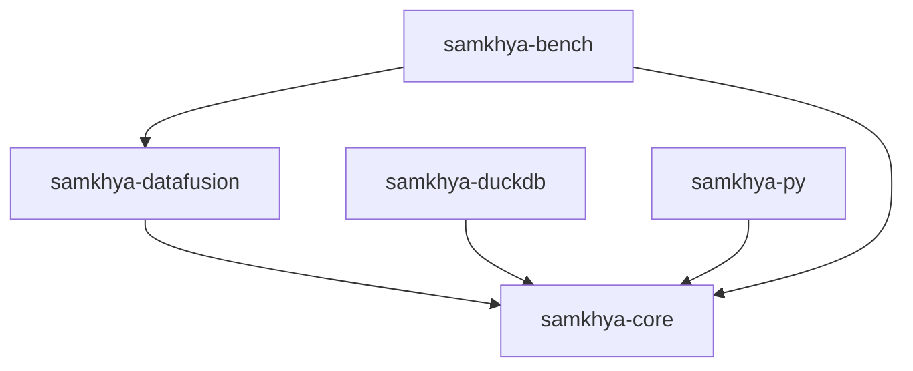
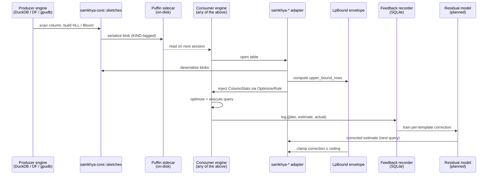

# samkhya — Architecture

> Developer-facing architectural overview. The full research bootstrap (5-agent
> sweep, lit review, publication strategy, 40-entry bibliography) lives in
> [`samkhya.md`](./samkhya.md). When in doubt, this file describes *how the code
> is shaped*; `samkhya.md` describes *why it exists*.

---

## 1. Overview

**samkhya** (सांख्य — *"enumeration / counting"*) is a Rust library for
**portable cardinality correction in embedded analytical engines**. It gives
optimizers in DataFusion, DuckDB, Polars, and gpudb accurate visibility into
what a query plan will actually cost — by shipping classical sketches through
[Iceberg Puffin](#9-glossary) sidecars, recording feedback from completed
queries, and bounding every correction by a provable pessimistic ceiling.

Consumers fall into two groups:

1. **Embedded engines** (Rust, C++, GPU extensions) that link `samkhya-core`
   plus the adapter crate matching their planner surface
   (`samkhya-datafusion`, `samkhya-duckdb`).
2. **Python users** (notebooks, dbt-style pipelines) who consume the same
   primitives through `samkhya-py` PyO3 bindings.

samkhya is **explicitly NOT**:

- A learned cardinality estimator. (Naru / NeuroCard / MSCN / DeepDB are dead
  repos; see `samkhya.md` §2 Agent A.)
- An adaptive query execution framework. (Spark AQE already owns that label.)
- A daemon, server, or hosted service. samkhya is a library you call; it never
  runs in the background.
- An AI / deep-learning / foundation-model product. Sketches and feedback are
  the substrate; ML is one optional pluggable backend among others.

See `samkhya.md` §1 (TL;DR) and §3 (project shape) for the full positioning.

---

## 2. Crate Layout

The repository is a Cargo workspace with five member crates.

| Crate | Purpose |
|---|---|
| `samkhya-core` | Sketches, `ColumnStats`, Puffin I/O (planned), feedback recorder (planned), LpBound envelope (planned), residual model (planned). Pure Rust, no engine dependencies. |
| `samkhya-datafusion` | DataFusion adapter — implements `OptimizerRule` and a `TableProvider` shim that surfaces `ColumnStats` to the DF planner. First-class integration target. |
| `samkhya-duckdb` | DuckDB extension shipping sketches as `BLOB` columns plus a metadata table the planner consults. Bridges Rust ↔ C++ via `cxx`. |
| `samkhya-py` | PyO3 bindings exposing `HllSketch`, `BloomFilter`, `ColumnStats`, and Puffin readers/writers to Python (notebooks, dbt). |
| `samkhya-bench` | Benchmark harness: JOB-Slow, TPC-H Q21, STATS-CEB. Measures p95 latency and q-error against the week-13 GO/NO-GO gate (`samkhya.md` §4). |

### Workspace dependency graph

`samkhya-core` has zero engine dependencies; every adapter pulls *from* it,
never the other way around. This keeps the core portable enough that a future
adapter (Polars, gpudb, Postgres extension) is purely additive.

---

## 3. The Five-Layer Design

The architecture is a stack of five layers, distilled from `samkhya.md` §3.
Sketches are implemented today; the layers above are scaffolded as named
modules and tracked against the 90-day MVP plan in `samkhya.md` §4.

### Layer 1 — Portable Stats Layer (Puffin + sketches)

Encodes column-level summaries (HLL for distinct counts, Bloom for membership,
KLL / t-digest / multi-column histograms planned) and ships them between
engines via Iceberg Puffin sidecar files. Every sketch implements a uniform
`Sketch` trait (`to_bytes` / `from_bytes` + a stable `KIND` tag) so the same
payload can be written by DuckDB and read by DataFusion without engine-specific
glue. See [`samkhya-core/src/sketches.rs`](./samkhya-core/src/sketches.rs).

Why it matters: every embedded engine recomputes stats from scratch on every
session, because no portable producer/consumer library exists. Apache
DataSketches has sketches but no query-optimizer story. Puffin is a file
format with no library. samkhya is the missing piece.

**Status: implemented.** `HllSketch` (precision 4–18) and `BloomFilter`
(Kirsch-Mitzenmacher double hashing) are working with round-trip tests;
KLL / t-digest / multi-column histograms are next on the roadmap.

### Layer 2 — Feedback Recorder (Bao / AutoSteer pattern)

Hooks query execution, captures `(plan, estimate, actual)` triples, and
persists them to a SQLite sidecar keyed by query template. A per-template
correction model (gradient-boosted trees, sub-MB) learns the bias between the
planner's estimate and observed reality. Corrections are surfaced as **hints**
to the native optimizer — never as a replacement for it. If the recorder is
absent or empty, the engine sees its own untouched estimates.

Why it matters: Bao and AutoSteer are the only learned query-optimization
patterns with documented production deployment (Vertica, Redshift, Synapse —
see `samkhya.md` §2 Agent A). Every other learned approach handwaves cold
start. Feedback-driven correction sidesteps cold start by design: you start
with the native plan, you improve only when the recorder has evidence.

**Status: planned (Weeks 7–8 in `samkhya.md` §4).** Module name reserved as
`samkhya-core::feedback`.

### Layer 3 — Pessimistic Safety Envelope (LpBound-style; NEVER REGRESS)

Computes a provable upper bound on join cardinality via LP relaxation over
ℓp-norms of degree sequences — the construction from LpBound (SIGMOD 2025
Best Paper, [arXiv 2502.05912](https://arxiv.org/abs/2502.05912)), no ML
involved. The bound is stored on `ColumnStats::upper_bound_rows`
([`samkhya-core/src/stats.rs`](./samkhya-core/src/stats.rs)) and is the
contract every other layer must honour: any corrected estimate that exceeds
the ceiling is rejected with `Error::LpBoundExceeded`
([`samkhya-core/src/error.rs`](./samkhya-core/src/error.rs)).

Why it matters: this is the non-negotiable safety guarantee. Cold start
equals the native plan or better — never worse. The envelope makes that
provable, not aspirational. Without it, samkhya would be just another
correction system that occasionally explodes.

**Status: planned (Weeks 9–10 in `samkhya.md` §4).** Module name reserved as
`samkhya-core::lpbound`. The `Error` enum already carries the variant.

### Layer 4 — GPU Batch Inference (optional, via gpudb)

When samkhya is paired with [gpudb](https://github.com/singhpratech/gpudb)
(Prateek's GPU-accelerated DuckDB extension), the correction model can score
thousands of subplan candidates in a single CUDA or Apple Silicon Metal
kernel launch. This is the differentiator vs. TiCard and every other
embedded-engine CE work: zero published systems target batch GPU inference of
the correction model itself.

Why it matters: subplan enumeration is inherently parallel — each candidate
is an independent forward pass through a tiny GBT or PFN. CPU inference
serializes; GPU batches it. For sole-author gpudb users this is free
leverage.

**Status: planned (post-MVP).** GPU is *strictly opt-in*: samkhya never
links CUDA or Metal in default builds. The `gpudb` dependency is a separate
adapter, not a core requirement.

### Layer 5 — TabPFN-as-pluggable-backend

The correction-model interface is designed so a foundation tabular model
(TabPFN-2.5 — [arXiv 2511.08667](https://arxiv.org/abs/2511.08667) — or its
successors) can drop in behind the same trait. If the field consolidates on
foundation tabular models in the 18–24 month window flagged by `samkhya.md`
§2 Agent E, samkhya becomes the engine-side infrastructure (Puffin,
feedback recorder, LpBound envelope) around whichever model wins.

Why it matters: this is samkhya's existential-threat mitigation. The
contract is *"feed `(schema, sample, query)` to the backend; receive
`estimate` clamped to LpBound ceiling."* A 50-line wrapper over an inference
API satisfies that contract just as well as a hand-tuned GBT does.

**Status: planned.** The residual-model trait will land in Weeks 11–12 and
will be designed for the PFN interface from the start, not retrofitted.

---

## 4. Data Flow

Stats flow through the system in two cycles: a **producer cycle** that writes
sketches to disk, and a **consumer cycle** that reads them and folds in
feedback. Both cycles cross engine boundaries.

Step-by-step:

1. **Sketch construction.** The producer engine scans a column once and feeds
   bytes to `HllSketch::add` / `BloomFilter::insert`. Sketches are
   merge-friendly: parallel scanners can build per-partition sketches and
   merge at the end.
2. **Puffin write.** Each sketch is serialized via its `Sketch::to_bytes`
   implementation and written into a Puffin blob with the sketch's stable
   `KIND` tag (`"samkhya.hll-v1"`, `"samkhya.bloom-v1"`).
3. **Puffin read.** A different engine — possibly in a different process,
   possibly on a different machine — opens the Puffin sidecar and
   reconstitutes sketches via `Sketch::from_bytes`.
4. **`ColumnStats` assembly.** The adapter folds sketches into a `ColumnStats`
   struct ([`samkhya-core/src/stats.rs`](./samkhya-core/src/stats.rs)),
   filling in `distinct_count`, `null_count`, min/max bounds, and the LpBound
   `upper_bound_rows` ceiling.
5. **Optimizer injection.** The adapter (e.g., `samkhya-datafusion`) walks the
   logical plan via an `OptimizerRule` and substitutes the engine's default
   stats with the samkhya-supplied ones.
6. **Execution + feedback.** Once the query finishes, the recorder writes
   `(plan template, estimated rows, actual rows)` to its SQLite store.
7. **Residual training.** Periodically the residual model is retrained on the
   recorder's contents; on the next query it returns a corrected estimate.
8. **Envelope clamp.** Before the corrected estimate reaches the optimizer,
   the LpBound layer clamps it to `upper_bound_rows`. A correction that
   exceeds the ceiling is rejected and the native estimate is used instead.

The clamp at step 8 is the **NEVER REGRESS** guarantee made concrete.

---

## 5. `samkhya-core` Module Map

| Module | API surface | Status |
|---|---|---|
| `error` | `Error` enum (Io / Serde / InvalidPuffin / InvalidSketch / Feedback / LpBoundExceeded) and `Result<T>` alias. | Implemented ([`error.rs`](./samkhya-core/src/error.rs)). |
| `stats` | `ColumnStats` (superset of DataFusion `ColumnStatistics` and DuckDB `BaseStatistics`), `Bound` enum (Int / Float / Str / Bytes), builder helpers. | Implemented ([`stats.rs`](./samkhya-core/src/stats.rs)). |
| `sketches` | `Sketch` trait with `KIND` tag plus `to_bytes` / `from_bytes`. Re-exports `HllSketch` and `BloomFilter`. | Implemented ([`sketches.rs`](./samkhya-core/src/sketches.rs)). |
| `sketches::hll` | `HllSketch::{new, add, estimate, merge, precision}`; xxhash64-based; precision 4–18; relative error ≈ 1.04 / √(2^p). | Implemented ([`hll.rs`](./samkhya-core/src/sketches/hll.rs)). |
| `sketches::bloom` | `BloomFilter::{new, insert, contains, num_bits, num_hashes}`; Kirsch-Mitzenmacher double hashing; sized from capacity + false-positive rate. | Implemented ([`bloom.rs`](./samkhya-core/src/sketches/bloom.rs)). |
| `puffin` | Reader / writer for Iceberg Puffin v1 sidecars; magic bytes, footer, blob metadata index, snappy/zstd compression. | Planned (Weeks 3–4). |
| `feedback` | Hook trait the adapters call after execution; SQLite-backed store; per-template aggregation. | Planned (Weeks 7–8). |
| `lpbound` | Pessimistic upper-bound computation via LP over ℓp-norms; produces `ColumnStats::upper_bound_rows`. | Planned (Weeks 9–10). |
| `residual` | Trait `Corrector` for residual models; default GBT backend (~100 KB); TabPFN backend stub. | Planned (Weeks 11–12). |

Re-exports at the crate root: `Error`, `Result`, `ColumnStats`.

---

## 6. Integration Surfaces

### DataFusion (`samkhya-datafusion`) — first-class

DataFusion is the cleanest plug surface in the embedded-engine space (`samkhya.md`
§2 Agent B). The adapter is a thin layer that implements
[`OptimizerRule`](https://docs.rs/datafusion/latest/datafusion/optimizer/trait.OptimizerRule.html),
opens the Puffin sidecar associated with each `TableProvider`, deserializes
the sketches, and injects the resulting `ColumnStats` into the planner during
the analysis phase. DataFusion 46's `Distribution` framework already accepts
external column stats; samkhya simply supplies better ones. No fork of
DataFusion required.

### DuckDB (`samkhya-duckdb`)

DuckDB exposes neither a Rust planner API nor a stable C++ optimizer hook,
so the adapter ships as a loadable extension following the
[Query-farm/datasketches](https://github.com/Query-farm/datasketches) pattern:
sketches are stored as DuckDB `BLOB` columns, exposed via scalar/aggregate
functions, and a metadata table (`_samkhya_stats`) is consulted by a rewrite
rule. Rust ↔ C++ bridging via `cxx`. The same Puffin payload that DataFusion
reads is what DuckDB reads — that is the portability moat.

### Polars

Polars has no CBO and no extension hook ([Issue #23345](https://github.com/pola-rs/polars/issues/23345)).
Integration is upstream-collaboration-shaped: samkhya supplies stats; Polars
needs to grow a join-reordering pass that consumes them. Tracked as future
work, not in the 90-day MVP.

### gpudb

gpudb is Prateek's existing GPU-accelerated DuckDB extension. samkhya
integration is what unlocks **Layer 4** of the design: the CUDA / Metal
kernels in gpudb can score subplan candidates in batch using the residual
model. This is the only integration where samkhya touches GPU code, and it
is strictly opt-in.

### Python (`samkhya-py`)

PyO3 bindings expose `HllSketch`, `BloomFilter`, `ColumnStats`, and the
Puffin reader/writer to Python. Use case: dbt-style pipelines that compute
sketches once during nightly ELT and write them as Puffin sidecars next to
Parquet files, so the next morning's DuckDB / DataFusion ad-hoc queries
inherit them for free. No Python ML stack required — the bindings cover
the *portable stats layer*, not the residual model.

### Stats round-trip via Puffin — the portability moat

The reason all of the above can coexist: every sketch is identified by a
stable `KIND` string (e.g., `"samkhya.hll-v1"`) and serialized via a
versioned `to_bytes` / `from_bytes` pair. A Puffin sidecar produced by
`samkhya-py` is byte-identical to one produced by `samkhya-duckdb` and
fully readable by `samkhya-datafusion`. No engine owns the stats; the
sidecar does. This is what no prior library has built: DataSketches has
sketches without a query story, AQO has feedback without portability,
Iceberg Puffin is a file format with no producer/consumer library. samkhya
is the union.

---

## 7. Non-Goals

samkhya does **not**:

- **Replace the engine's optimizer.** Adapters inject stats and hints; the
  native planner stays in charge.
- **Retrain online.** Residual training is periodic, batched, and offline-ish
  (between queries, not during).
- **Run as a daemon or service.** No background process. The caller invokes
  samkhya synchronously, in-process.
- **Require CUDA or Metal.** GPU support is opt-in via gpudb; default builds
  do not link any GPU runtime.
- **Rebrand as AI / learned / adaptive / deep-learning.** The ML layer is
  one pluggable backend among others. Framing intentionally avoids triggering
  ML-skeptic DBA reflexes (see `samkhya.md` §3 critical naming rules).
- **Target server-class OLTP databases.** Postgres, MySQL, CockroachDB are
  out of scope; the design assumes embedded analytical workloads.
- **Compete with Spark AQE.** AQE is in-engine runtime adaptation;
  samkhya is portable cross-engine stats. Different problem.

---

## 8. Safety Guarantees

- **Cold start: native plan or better, never worse.** The LpBound envelope
  guarantees that any correction is bounded above by a provable ceiling; if
  the corrector has no evidence, no correction is applied and the engine
  sees its own untouched estimates.
- **Sub-MB model footprint.** Residual models target ~100 KB on disk,
  vs. 40–300 MB in published learned-CE systems (`samkhya.md` §2 Agent A).
- **Sub-ms inference.** Per-estimate latency budget is under one millisecond,
  vs. 5–50 ms in published systems. Achieved via tiny GBT models and
  per-template caching.
- **Library, not service.** No daemon, no background thread, no IPC. The
  caller controls when samkhya runs.
- **Bounded fallback.** Every correction is reversible within a single
  query: if the LpBound clamp fires or the recorder fails, the engine
  silently falls back to its native estimate. The user never observes a
  catastrophic plan.
- **No CUDA requirement.** GPU support is gated behind the `samkhya-gpudb`
  adapter. Default `cargo build` links no GPU code.

---

## 9. Glossary

- **q-error** — ratio between estimated and true cardinality:
  `max(est/true, true/est)`. The standard cardinality-estimation accuracy
  metric.
- **cardinality** — number of rows produced by a relational operator
  (table scan, filter, join). Optimizer decisions hinge on accurate
  cardinality predictions.
- **JOB-Slow** — subset of the Join Order Benchmark consisting of the
  slowest / hardest queries on IMDb. Standard stress test for query
  optimizers; samkhya's week-13 GO/NO-GO gate measures p95 latency on it.
- **STATS-CEB** — Cardinality Estimation Benchmark from Han et al. VLDB
  2022, built on top of the STATS dataset. The other standard benchmark
  samkhya targets.
- **Puffin** — Iceberg's sidecar file format for storing statistics
  (sketches, NDV, bloom filters, histograms) alongside table snapshots.
  Producer / consumer library is what samkhya provides.
- **Iceberg** — Apache table format for analytical data lakes. Puffin is
  Iceberg's auxiliary stats format.
- **Bao** — Marcus et al., SIGMOD 2021 Best Paper. Tree-CNN plus Thompson
  sampling over 48 hint sets; never replaces the optimizer, only steers
  it. The only learned-QO pattern with production deployment.
- **AutoSteer** — Anneser et al., VLDB 2023. Generalizes Bao to any SQL
  database via knob discovery. samkhya inherits the *observe-and-hint*
  pattern from both.
- **AQE** — Adaptive Query Execution. In-engine runtime re-planning based
  on observed shuffle sizes etc. Spark AQE, Snowflake Adaptive Compute,
  BigQuery HBO, Presto HBO. *Different problem from samkhya* — AQE adapts
  one query mid-flight; samkhya makes stats portable between queries and
  between engines.
- **LpBound** — Zhang et al., SIGMOD 2025 Best Paper
  ([arXiv 2502.05912](https://arxiv.org/abs/2502.05912)). Pessimistic
  upper bound on join cardinality via LP over ℓp-norms of degree
  sequences. **No ML.** samkhya's safety envelope.
- **residual model** — small model that predicts the bias between the
  engine's native cardinality estimate and the true cardinality observed
  at execution time. Per-template, sub-MB, sub-ms.

---

## 10. Further Reading

This file is the developer-facing distillation. The complete research
bootstrap — the 5-agent parallel sweep, lit review with 40-entry
bibliography, production-optimizer survey, OSS landscape audit, publication
strategy, 90-day MVP plan with kill criteria, and the full reading list —
lives in [`samkhya.md`](./samkhya.md).

Cross-references used in this file:

- [`samkhya.md` §1](./samkhya.md) — TL;DR verdict from the research sweep
- [`samkhya.md` §2](./samkhya.md) — Agent A (lit review), Agent B (optimizer
  survey), Agent C (OSS landscape), Agent D (publication strategy), Agent E
  (devil's advocate)
- [`samkhya.md` §3](./samkhya.md) — Project shape, architecture diagram,
  critical naming rules, non-negotiables
- [`samkhya.md` §4](./samkhya.md) — 90-day MVP plan, week-13 GO/NO-GO gate,
  kill criteria
- [`samkhya.md` §6](./samkhya.md) — Reading list (3 mandatory papers +
  bibliography)

When this file and `samkhya.md` disagree, `samkhya.md` is authoritative for
*intent and framing*; this file is authoritative for *what the code does
today*.
